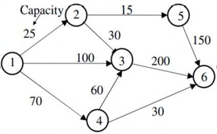
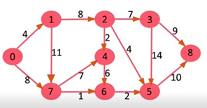

# Ford-Fulkerson Algorithm

This code implements the Ford-Fulkerson algorithm for finding the maximum flow in a graph.

The output is the maximum flow found, along with a track of the capacity of edges to transport this flow. 

The code uses a "residual graph" to save the maximum flow of each iteration. The residual graph is a copy of the original graph, but this is set with the capacities of the edges that transport the maximum flow found in each iteration. This allows the code to find the maximum flow in a graph by iteratively finding paths from the source vertex to the sink vertex, subtracting the capacity of the edges of the main graph of each from the capacities of the edges in the residual graph of each iteration. The algorithm terminates when there are no more paths from the source vertex to the sink vertex.

## Usage

1. Prepare your input data:

* Create a CSV file representing the graph.
* The CSV file should contain a square matrix where each element represents the capacity of an edge between two nodes.
* The values should be non-negative integers.

2. To run the code, you will need to have Python 3 installed. Once you have Python 3 installed, you can run the code by typing the following command in a terminal:

```
python ford_fulkerson.py <filename> <source> <sink>
```
Arguments:

* `filename`: the name or the path of the CSV file.
* `source` and `sink`: the indices of the source and sink nodes in the graph, respectively.

### Examples

The code can be tested with three examples:



In this graph the source node is 0 and the sink node is 5. You can run the code typing the command:

```
python ford_fulkerson.py example.csv 0 5
```



In this graph the source node is 0 and the sink node is 8. You can run the code typing the command:

```
python ford_fulkerson.py example2.csv 0 8
```

In this graph the source node is 0 and the sink node is 31. You can run the code typing the command:

```
python ford_fulkerson.py example3.csv 0 31
```

It can also be possible to test the algorithm just modify the file `test_fordfulkerson.py` and type this command:

```
pytest test_fordfulkerson.py
```
